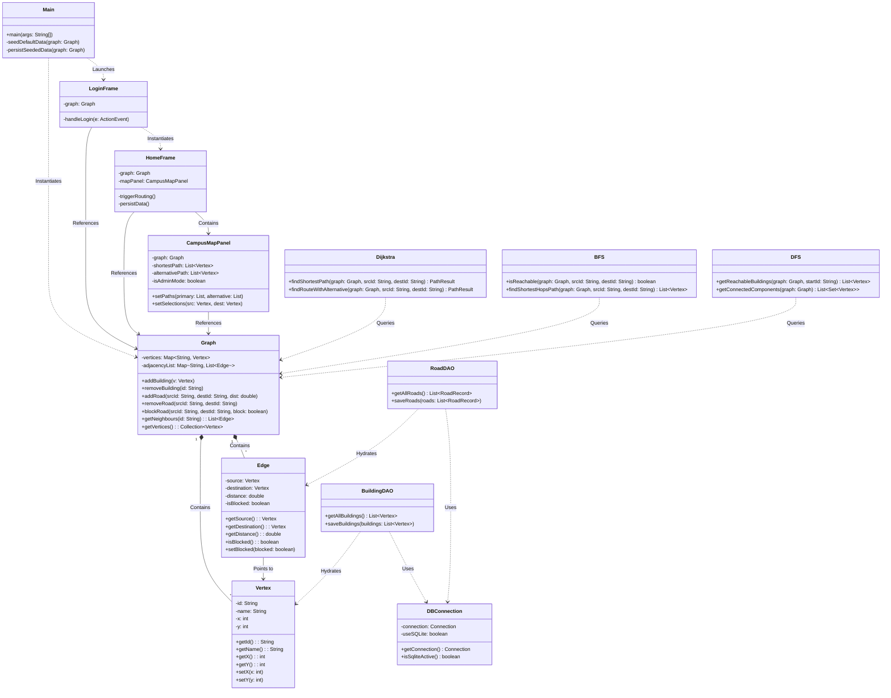

# UML Class Diagram

This document describes the architectural class relationships of the Smart Campus Navigation System.

```mermaid
classDiagram
    direction TB
    
    class Main {
        +main(args: String[])
        -seedDefaultData(graph: Graph)
        -persistSeededData(graph: Graph)
    }

    class Vertex {
        -id: String
        -name: String
        -x: int
        -y: int
        +getId(): String
        +getName(): String
        +getX(): int
        +getY(): int
        +setX(x: int)
        +setY(y: int)
    }

    class Edge {
        -source: Vertex
        -destination: Vertex
        -distance: double
        -isBlocked: boolean
        +getSource(): Vertex
        +getDestination(): Vertex
        +getDistance(): double
        +isBlocked(): boolean
        +setBlocked(blocked: boolean)
    }

    class Graph {
        -vertices: Map~String, Vertex~
        -adjacencyList: Map~String, List~Edge~~
        +addBuilding(v: Vertex)
        +removeBuilding(id: String)
        +addRoad(srcId: String, destId: String, dist: double)
        +removeRoad(srcId: String, destId: String)
        +blockRoad(srcId: String, destId: String, block: boolean)
        +getNeighbours(id: String): List~Edge~
        +getVertices(): Collection~Vertex~
    }

    class Dijkstra {
        +findShortestPath(graph: Graph, srcId: String, destId: String) PathResult
        +findRouteWithAlternative(graph: Graph, srcId: String, destId: String) PathResult
    }

    class BFS {
        +isReachable(graph: Graph, srcId: String, destId: String) boolean
        +findShortestHopsPath(graph: Graph, srcId: String, destId: String) List~Vertex~
    }

    class DFS {
        +getReachableBuildings(graph: Graph, startId: String) List~Vertex~
        +getConnectedComponents(graph: Graph) List~Set~Vertex~~
    }

    class DBConnection {
        -connection: Connection
        -useSQLite: boolean
        +getConnection() Connection
        +isSqliteActive() boolean
    }

    class BuildingDAO {
        +getAllBuildings() List~Vertex~
        +saveBuildings(buildings: List~Vertex~)
    }

    class RoadDAO {
        +getAllRoads() List~RoadRecord~
        +saveRoads(roads: List~RoadRecord~)
    }

    class LoginFrame {
        -graph: Graph
        -handleLogin(e: ActionEvent)
    }

    class HomeFrame {
        -graph: Graph
        -mapPanel: CampusMapPanel
        -triggerRouting()
        -persistData()
    }

    class CampusMapPanel {
        -graph: Graph
        -shortestPath: List~Vertex~
        -alternativePath: List~Vertex~
        -isAdminMode: boolean
        +setPaths(primary: List, alternative: List)
        +setSelections(src: Vertex, dest: Vertex)
    }

    Main ..> Graph : Instantiates
    Main ..> LoginFrame : Launches
    LoginFrame --> Graph : References
    LoginFrame ..> HomeFrame : Instantiates
    HomeFrame --> Graph : References
    HomeFrame --> CampusMapPanel : Contains
    CampusMapPanel --> Graph : References
    
    Graph "1" *-- "*" Vertex : Contains
    Graph "1" *-- "*" Edge : Contains
    Edge --> Vertex : Points to

    Dijkstra ..> Graph : Queries
    BFS ..> Graph : Queries
    DFS ..> Graph : Queries

    BuildingDAO ..> DBConnection : Uses
    RoadDAO ..> DBConnection : Uses
    BuildingDAO ..> Vertex : Hydrates
    RoadDAO ..> Edge : Hydrates
```
